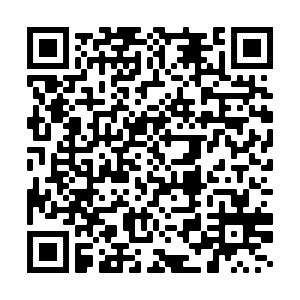
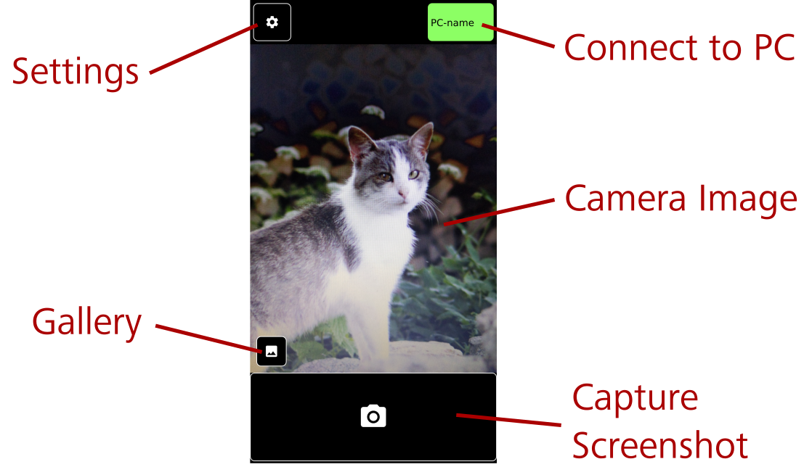
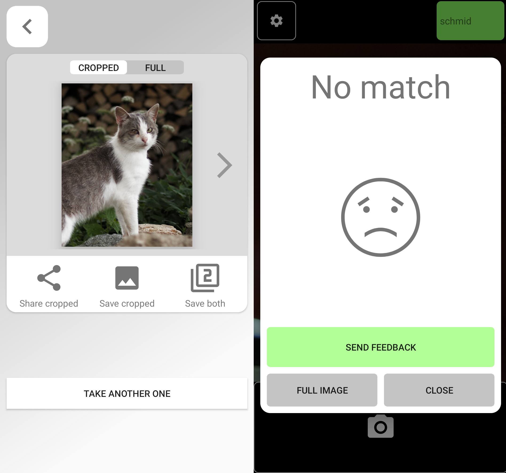

#  ScreenshotMatcher (WIP)

Oftentimes, taking photographs of a computer screen is preferred to capturing proper screenshots as it is fast, convenient and the picture is shared via the smartphone anyway.
However, image artifacts such as moiré patterns, reflections, and perspective distortion deteriorate image quality of such photos.
ScreenshotMatcher solves this problem by using the interaction technique of photographing a screen with the phone to capture high quality screenshots which are already cropped to the region of interest.
This is done by automatically capturing a screenshot on the PC, detecting and extracting the photographed region of interest with a feature matching algorithm and sending the result to the smartphone.
ScreenshotMatcher consists of a python program running on the PC and an Android application.

## State of the project

The project is in a late development stage.
All major features work, but there is still some refactoring, bugfixing and documentation to be done.
If interested in the project, check out [the paper](https://epub.uni-regensburg.de/47814/1/screenshotmatcher.pdf) or contact us (andreas.schmid@ur.de).

## Known Issues

Especially for regions with lots of text, the matching algorithm is still somewhat unreliable.
In this case, it is recommended to request a full screenshot from the PC and crop the result manually.

# Installation

**ScreenshotMatcher** is a two part application: an Android app and a python program running on the PC (Windows, MacOS, or Linux).
To use **ScreenshotMatcher**, both phone and PC have to be connected to the same WiFi network.

On Windows, a setup wizard can be used for the installation, on MacOS and Linux a working python installation is required.

## Installing the Desktop Application

### Windows

**Step 1:**
Download the setup wizard:
[TODO]

**Step 2:**
Run the setup wizard to install the application.
By default, **ScreenshotMatcher** is configured to automatically start when the system is turned on.
On some systems, a warning due to the installation of software from unknown sources pops up before the installation.
This warning can be ignored.

**Step 3:**
After the installation, **ScreenshotMatcher** starts automatically and can be accessed via an icon in the system tray (bottom right).
In case a warning from *Windows Defender* pops up, it can be ignored.

**Done!**
You can now continue with installing the Android app.

## Linux and MacOS

**Step 1:**
Install python 3.
A detailed guide for all major operating systems can be found here:
[https://realpython.com/installing-python/](https://realpython.com/installing-python/)

**Step 2:**
Install the python package manager pip:
A detailed guide for all major operating systems can be found here:
[https://www.makeuseof.com/tag/install-pip-for-python/](https://www.makeuseof.com/tag/install-pip-for-python/)

**Step 3:**
Download the desktop application's source code:
[TODO]

**Step 4:**
Unzip the download archive at a location of your choice.

**Step 5:**
Open a terminal and navigate to the directory with downloaded and extracted archive.
Enter the `Screenshotmatcher` directory and install requirements by running `pip install -r requirements.txt`.
On some systems, such as Debian based Linux distributions, it might be necessary to use `pip3` instead of `pip`.

**Step 6:**
Start **ScreenshotMatcher** either executing `sh ScreenshotMatcher` or by clicking on the **ScreenshotMatcher** shortcut in a visual file manager.

**Done!**
You can now continue with installing the Android app.

# Installing the Android App

**Step 1:**
Download the **ScreenshotMatcher** Android app by opening following [this link](https://github.com/PDA-UR/Screenshotmatcher-2.0/blob/master/android/app/build/outputs/apk/debug/app-debug.apk) on your smartphone.

You can also access the download link by scanning this QR code:

  

**Step 2:**
Open the downloaded `screenshotmatcher2.apk` on your Android phone to start the installation.
Warnings regarding the app not being certified by Google Play can be ignored.

**Step 3:**
Start the **ScreenshotMatcher** app and grant it access to the phone's camera and file system.

**Step 4:**
In case **ScreenshotMatcher** is already running on the PC, the app should connect automatically.
A successful connection is indicated by a green area in the top right corner of the app.
If the area is red, click it to open a list with devices available for connection.

**Done!**
As soon as the connection between phone and PC is established, **ScreenshotMatcher** can be used.

# Overview and Usage

Use the **ScreenshotMatcher** app to photograph your PC's screen.
The photographed region is then extracted from the screen's content and the result is sent back to the phone.
This way, high quality screenshots can be captured by photographing a screen region with the phone.

  

If the photographed region could be found within the screen's content, the result image can be shared with other applications by clicking *Share cropped*, or saved to the phone's gallery by clicking *Save cropped*.
In case the extraction failed or you dislike the result, a screenshot of the whole screen can be requested by switching from *Cropped* to *Full* with the top button.

  

## Settings and Security

**ScreenshotMatcher** can be customized with settings available by clicking the tray icon.

It is possible to disable the access to full screenshots.
This way, only people who have line of sight to your monitor can capture your screen's content.

In networks with multiple users, it is recommended to restrict requests from unknown devices by either deciding individually or blocking all.
This way, only trusted devices can capture your screen's content.
